# Dabom API Core

가족 단위 디지털 사용량 관리 서비스를 위한 Spring Boot 백엔드입니다.
고객/관리자 인증, 가족 및 정책 관리, 미션-보상, 이의제기, 사용량 집계, 월간 리캡, 이미지 업로드, 알림 이벤트 발행을 담당합니다.

## Overview 🚀

- Language: Java 21
- Framework: Spring Boot 3.4
- DB: MySQL, Redis
- Messaging: Kafka
- Storage: Cloudflare R2(S3 호환)
- Docs: Springdoc OpenAPI, Swagger UI
- Observability: Actuator, Prometheus, OTLP(OpenTelemetry)

## 패키지 구조 🗂️

`src/main/java/com/project` 기준 주요 구조입니다.

```text
com.project
├─ Application.java
├─ common
│  ├─ api.response        # 공통 API 응답 포맷
│  ├─ auth                # JWT, 인터셉터, 인증 컨텍스트, 권한 AOP
│  ├─ config              # Web, Redis, JPA, Swagger, R2, 시간 설정
│  ├─ exception           # 공통 예외, 에러 코드, 전역 예외 처리
│  └─ util                # 공통 유틸리티
└─ domain
   ├─ admin              # 관리자 인증, 대시보드
   ├─ appeal             # 정책 이의제기, 댓글, 긴급 쿼터
   ├─ customer           # 고객 인증, 마이페이지, 내 정보
   ├─ eventoutbox        # 알림 이벤트 outbox 저장 및 Kafka 발행
   ├─ family             # 가족 정보, 구성원, 관리자용 가족 관리
   ├─ mission            # 미션 생성/조회/요청/로그/이력
   ├─ policy             # 정책 템플릿, 가족 정책 조회/수정
   ├─ recap              # 월간 가족 리캡 조회
   ├─ reward             # 보상 템플릿, 보상 승인/지급/수령 이력
   ├─ upload             # 관리자 이미지 업로드
   └─ usagerecord        # 가족/구성원 사용량 집계
```

도메인 패키지는 대체로 아래 레이어를 따릅니다.

- `controller`: HTTP API 진입점
- `service`: 비즈니스 로직
- `repository`: DB 조회/저장
- `entity`: JPA 엔티티
- `dto`: 요청/응답 DTO
- `model`: 서비스 반환 모델
- `enums`: 도메인 상태값

## 핵심 기능 ⚙️

### 1. 고객/관리자 인증 🔐

- 고객: 회원가입, 로그인, 토큰 재발급, 내 정보, 마이페이지 조회
- 관리자: 회원가입, 로그인, 토큰 재발급, 내 정보, 대시보드 조회
- JWT 기반 인증이며 대부분의 API는 `LoginInterceptor`에서 토큰을 검증합니다.
- 관리자 전용 API는 `@AdminOnly`, 보호자 전용 API는 `@OwnerOnly`로 제어합니다.

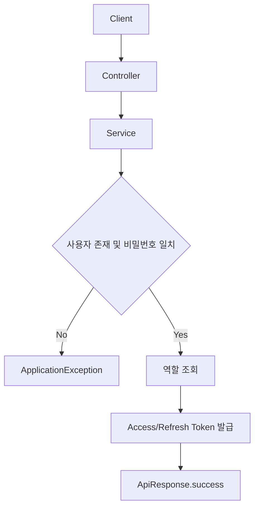

### 2. 가족 및 정책 관리 👨‍👩‍👧‍👦

- 보호자는 가족 이름을 변경하고 가족 구성원을 조회할 수 있습니다.
- 보호자는 가족 구성원별 정책을 수정할 수 있습니다.
- 정책 변경 시 DB 반영뿐 아니라 Redis 정책 동기화와 알림 발행이 함께 수행됩니다.
- 월간 제한 정책은 `CustomerQuota`를 함께 갱신하고, 수동 차단 정책은 차단 상태까지 반영합니다.

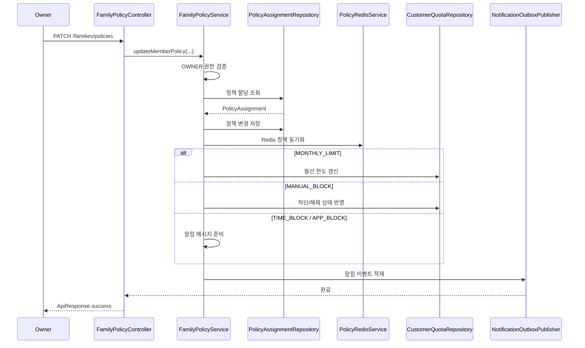

### 3. 미션 생성과 보상 승인 🎯

- 보호자는 미션을 생성하고 취소할 수 있습니다.
- 멤버는 자신에게 할당된 미션에 대해 완료 요청을 생성할 수 있습니다.
- 보호자는 요청을 승인/거절할 수 있고, 승인 시 `RewardGrant`가 발급됩니다.
- 미션/보상 흐름은 로그 저장과 알림 발행을 함께 수행합니다.

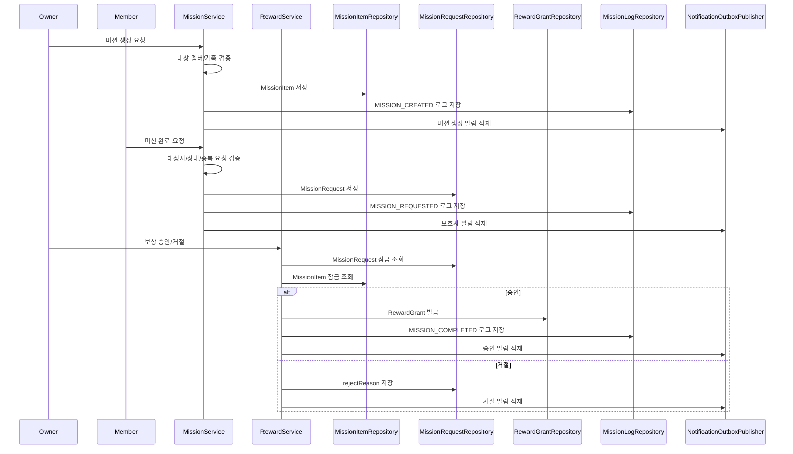

### 4. 이의제기와 긴급 쿼터 📝

- 멤버는 본인에게 적용된 정책에 대해 이의제기를 생성할 수 있습니다.
- 보호자는 이의제기를 승인/거절할 수 있으며 승인 시 정책 적용값이 즉시 반영됩니다.
- 멤버는 월 1회 긴급 쿼터를 요청할 수 있고, 승인 즉시 개인 월간 제한량이 증가합니다.

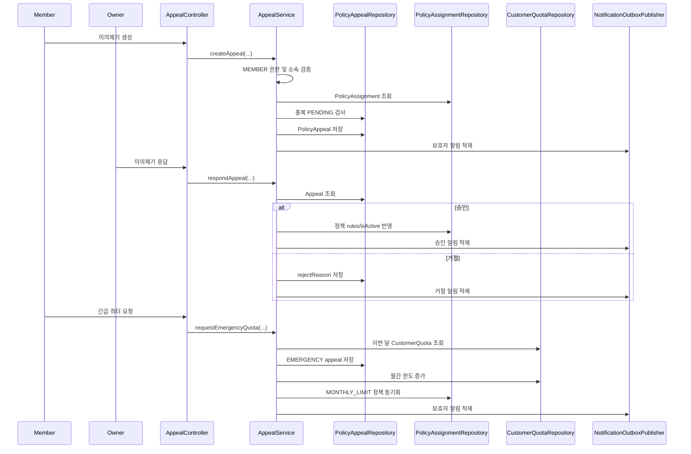

### 5. 사용량/리캡 조회 📊

- 가족 현재 총 사용량, 가족 구성원별 월간 사용량 요약, 대시보드용 상세 분포를 제공합니다.
- 월간 리캡은 DB에 저장된 스냅샷 JSON을 역직렬화해 응답합니다.

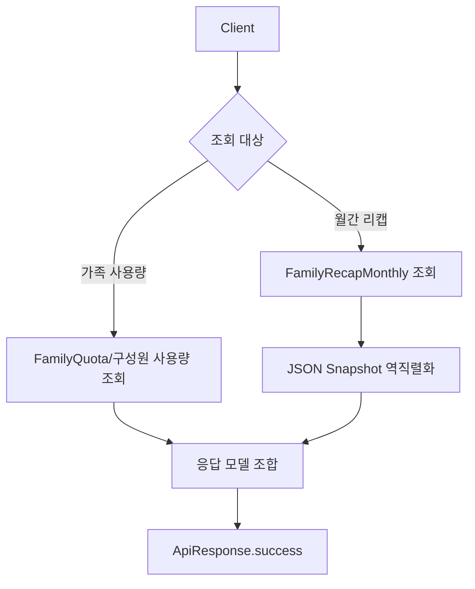

### 6. 알림 이벤트 Outbox 📬

- 미션 생성, 보상 요청/승인, 정책 변경, 이의제기 생성/응답 등 주요 이벤트는 바로 Kafka로만 보내지 않고 Outbox 테이블에 먼저 저장합니다.
- 트랜잭션 커밋 이후 `PUBLISH_PENDING` 상태의 이벤트를 발행하고, 성공 시 `SENT`로 마킹합니다.
- 발행 실패 시 row를 유지하므로 재시도 전략을 붙이기 좋은 구조입니다.

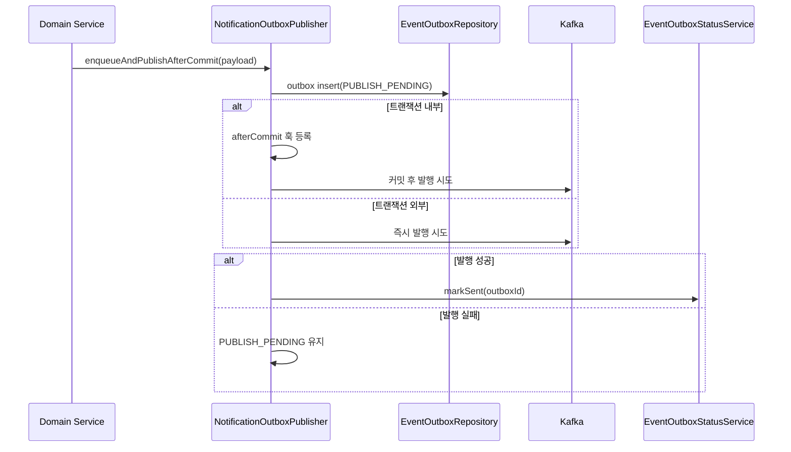

## 이 레포에서 눈여겨볼 구조 👀

### 정책 변경이 `Redis + DB + 알림`으로 이어지는 상태 동기화 구조 🔄

- 정책 수정은 단순히 `policy_assignment`만 바꾸지 않습니다.
- `FamilyPolicyServiceImpl`에서 DB 저장 후 Redis 정책을 동기화합니다.
- 정책 타입에 따라 `customer_quota`까지 함께 변경합니다.
- 마지막으로 사용자에게 알림 이벤트를 발행합니다.

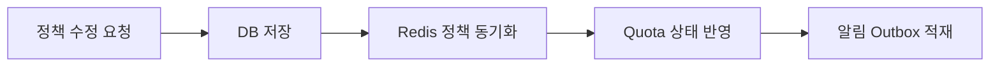

### 미션/보상/이의제기에서 cursor 기반 목록 조회 사용 ↔️

- `missions`, `missions/logs`, `missions/history`, `appeals`, `rewards/received` 등은 cursor 기반 페이지네이션을 사용합니다.
- 보통 `size + 1`개를 조회한 뒤 `hasNext`와 `nextCursor`를 계산합니다.
- 커서 파싱 실패 시 도메인별 예외 코드로 응답합니다.

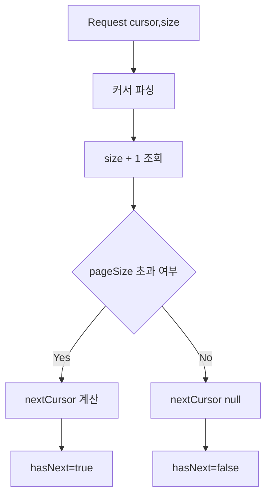

### 알림 이벤트를 위한 Outbox 패턴 사용 📦

- 도메인 트랜잭션과 메시지 발행의 원자성을 느슨하게 맞추기 위한 구조입니다.
- 먼저 Outbox에 적재하고 커밋 이후 발행합니다.
- 재시도 가능성을 위해 실패 시 상태를 유지합니다.

### 리캡 응답에 JSON 스냅샷 역직렬화 사용 🧩

- `FamilyRecapMonthly`는 요일별 사용량, 피크 사용 시간, 미션/이의제기 요약 등의 JSON 스냅샷을 문자열로 저장합니다.
- `RecapServiceImpl`에서 요청 시점에 역직렬화해 응답 모델로 변환합니다.

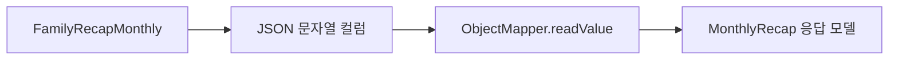

### 관리자 API와 고객 API의 인증/권한 경로가 분리되어 있음 🛡️

- 고객 API는 `/customers`, `/families`, `/missions`, `/appeals`, `/rewards`, `/recaps` 등에 분산되어 있습니다.
- 관리자 API는 `/admin/**` 경로 아래로 별도 분리되어 있습니다.
- 권한 체크도 `@AdminOnly`와 `@OwnerOnly`로 명확히 분리됩니다.

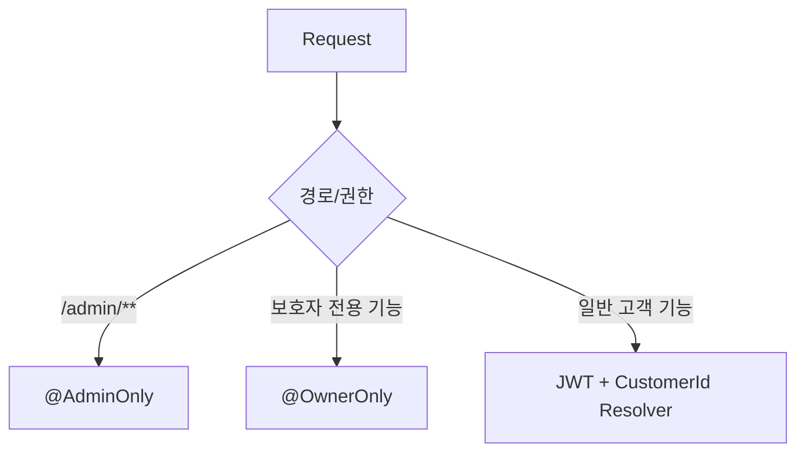

## API 응답 규약 📘

모든 응답은 `ApiResponse<T>`로 감싸집니다.

성공 예시:

```json
{
  "success": true,
  "data": {
    "id": 1
  },
  "timestamp": "2026-03-19T00:00:00Z"
}
```

실패 예시:

```json
{
  "success": false,
  "error": {
    "code": "MISSION_006",
    "message": "이미 처리 대기 중인 요청이 존재합니다.",
    "details": null
  },
  "timestamp": "2026-03-19T00:00:00Z"
}
```

## 요청/응답 DTO 예시 🧾

### 1. 고객 로그인 🔑

Request:

```json
{
  "phoneNumber": "01012345678",
  "password": "1234"
}
```

Response:

```json
{
  "success": true,
  "data": {
    "accessToken": "eyJhbGciOi...",
    "refreshToken": "eyJhbGciOi...",
    "role": "MEMBER"
  },
  "timestamp": "2026-03-19T00:00:00Z"
}
```

### 2. 미션 목록 조회 📋

Request:

```http
GET /missions?cursor=120&size=20
```

Response:

```json
{
  "success": true,
  "data": {
    "missions": [
      {
        "missionItemId": 101,
        "requestId": 55,
        "missionText": "숙제 30분 하기",
        "requestStatus": "PENDING",
        "target": {
          "customerId": 7,
          "name": "민수"
        },
        "createdBy": {
          "customerId": 1,
          "name": "엄마"
        },
        "reward": {
          "rewardId": 3,
          "name": "젤리 1개",
          "category": "SNACK",
          "thumbnailUrl": "https://cdn.example.com/reward/jelly.png",
          "templateId": 12
        },
        "createdAt": "2026-03-19T09:30:00"
      }
    ],
    "nextCursor": "101",
    "hasNext": true
  },
  "timestamp": "2026-03-19T00:00:00Z"
}
```

### 3. 가족 정책 수정 🛠️

Request:

```json
{
  "updateInfo": {
    "customerId": 7,
    "type": "MONTHLY_LIMIT",
    "rules": {
      "limitBytes": 3221225472
    },
    "isActive": true
  }
}
```

Response:

```json
{
  "success": true,
  "data": {
    "customerId": 7,
    "type": "MONTHLY_LIMIT",
    "updated": true
  },
  "timestamp": "2026-03-19T00:00:00Z"
}
```

### 4. 이의제기 생성 ✍️

Request:

```json
{
  "policyAssignmentId": 99,
  "requestReason": "숙제 제출 때문에 오늘만 제한을 완화해주세요.",
  "desiredRules": {
    "startTime": "23:00",
    "endTime": "07:00"
  },
  "policyActive": true
}
```

Response:

```json
{
  "success": true,
  "data": {
    "appealId": 201,
    "policyAssignmentId": 99,
    "status": "PENDING",
    "policyActive": true,
    "desiredRules": {
      "startTime": "23:00",
      "endTime": "07:00"
    },
    "createdAt": "2026-03-19T10:15:00"
  },
  "timestamp": "2026-03-19T00:00:00Z"
}
```

## 엔드포인트 목록 🌐

### 인증/사용자 👤

| Method | Path | 설명 | 권한 |
| --- | --- | --- | --- |
| POST | `/customers/login` | 고객 로그인 | Public |
| POST | `/customers/signup` | 고객 회원가입 | Public |
| POST | `/customers/refresh` | 고객 토큰 재발급 | Public |
| POST | `/customers/logout` | 고객 로그아웃 | Public |
| GET | `/customers/me` | 고객 기본 정보 조회 | Customer |
| GET | `/customers/mypage` | 마이페이지 조회 | Customer |
| POST | `/admin/login` | 관리자 로그인 | Public |
| POST | `/admin/signup` | 관리자 회원가입 | Public |
| POST | `/admin/refresh` | 관리자 토큰 재발급 | Public |
| POST | `/admin/logout` | 관리자 로그아웃 | Public |
| GET | `/admin/me` | 관리자 내 정보 | Admin |
| GET | `/admin/dashboard` | 관리자 대시보드 | Admin |

### 가족/사용량 👨‍👩‍👧‍👦

| Method | Path | 설명 | 권한 |
| --- | --- | --- | --- |
| PUT | `/families` | 가족 이름 수정 | Owner |
| GET | `/families/members` | 가족 구성원 조회 | Owner |
| GET | `/families/usage/current` | 현재 가족 총 사용량 조회 | Customer |
| GET | `/families/usage/customers` | 월별 구성원 사용량 요약 | Customer |
| GET | `/families/usage/dashboard` | 월별 구성원 사용량 상세 | Customer |
| POST | `/admin/families` | 가족 검색 | Admin |
| GET | `/admin/families/{familyId}` | 가족 상세 조회 | Admin |
| PATCH | `/admin/families/{familyId}` | 가족 구성원 역할/한도 수정 | Admin |

### 정책 📏

| Method | Path | 설명 | 권한 |
| --- | --- | --- | --- |
| GET | `/policies/{policyId}` | 정책 템플릿 상세 조회 | Admin |
| GET | `/policies` | 정책 템플릿 목록 조회 | Admin |
| POST | `/policies` | 정책 템플릿 생성 | Admin |
| PUT | `/policies/{policyId}` | 정책 템플릿 수정 | Admin |
| DELETE | `/policies/{policyId}` | 정책 템플릿 삭제 | Admin |
| GET | `/families/policies` | 가족 구성원별 정책 조회 | Customer |
| PATCH | `/families/policies` | 특정 구성원 정책 수정 | Owner |

### 미션/보상 🎁

| Method | Path | 설명 | 권한 |
| --- | --- | --- | --- |
| GET | `/missions` | 미션 목록 조회 | Customer |
| GET | `/missions/logs` | 미션 로그 조회 | Customer |
| GET | `/missions/history` | 미션 요청 이력 조회 | Customer |
| POST | `/missions` | 미션 생성 | Owner |
| DELETE | `/missions/{missionId}` | 미션 취소 | Owner |
| POST | `/missions/{missionId}/request` | 미션 완료 요청 | Customer |
| GET | `/rewards/templates` | 보상 템플릿 목록 조회 | Owner |
| PUT | `/rewards/requests/{requestId}/respond` | 보상 요청 승인/거절 | Owner |
| GET | `/rewards/received` | 내 수령 보상 이력 조회 | Customer |
| GET | `/admin/rewards/templates` | 보상 템플릿 목록 조회 | Admin |
| GET | `/admin/rewards/templates/{id}` | 보상 템플릿 상세 조회 | Admin |
| POST | `/admin/rewards/templates` | 보상 템플릿 생성 | Admin |
| PUT | `/admin/rewards/templates/{id}` | 보상 템플릿 수정 | Admin |
| DELETE | `/admin/rewards/templates/{id}` | 보상 템플릿 삭제 | Admin |
| GET | `/admin/rewards/grants` | 보상 지급 이력 조회 | Admin |

### 이의제기/리캡/업로드 📎

| Method | Path | 설명 | 권한 |
| --- | --- | --- | --- |
| GET | `/appeals/policies` | 이의제기 가능 정책 목록 조회 | Customer |
| GET | `/appeals` | 이의제기 목록 조회 | Customer |
| GET | `/appeals/{appealId}` | 이의제기 상세 조회 | Customer |
| POST | `/appeals` | 이의제기 생성 | Customer |
| PATCH | `/appeals/{appealId}/respond` | 이의제기 승인/거절 | Owner |
| POST | `/appeals/{appealId}/comments` | 이의제기 댓글 작성 | Customer |
| PATCH | `/appeals/{appealId}/cancel` | 이의제기 취소 | Customer |
| POST | `/appeals/emergency` | 긴급 쿼터 요청 | Customer |
| GET | `/recaps/monthly` | 월간 가족 리캡 조회 | Customer |
| POST | `/uploads/images` | 이미지 업로드 | Admin |

## 인증과 권한 처리 🔒

### 인증 흐름 🔍

- `LoginInterceptor`가 대부분의 요청에서 `Authorization` 헤더를 추출합니다.
- `JwtTokenUtil`이 토큰 유효성, 만료, 타입을 검증합니다.
- `CustomerArgumentResolver`, `AdminArgumentResolver`가 컨트롤러 파라미터에 사용자 식별자를 주입합니다.

### 권한 제어 🚧

- `@AdminOnly`: 관리자 토큰만 허용
- `@OwnerOnly`: 가족 내 보호자 역할만 허용
- 서비스 레이어에서도 `AuthContext`와 가족 소속을 다시 검증해 도메인 무결성을 보장합니다.

## 에러 처리 🚨

전역 예외 처리는 `ExceptionAdvice`에서 담당합니다.

- 도메인 예외는 `ApplicationException extends BaseException`으로 던집니다.
- 각 도메인은 `BaseErrorCode` 구현 enum을 통해 HTTP 상태, 커스텀 코드, 메시지를 정의합니다.
- 처리되지 않은 예외는 `GLOBAL_001`로 통일해 반환합니다.

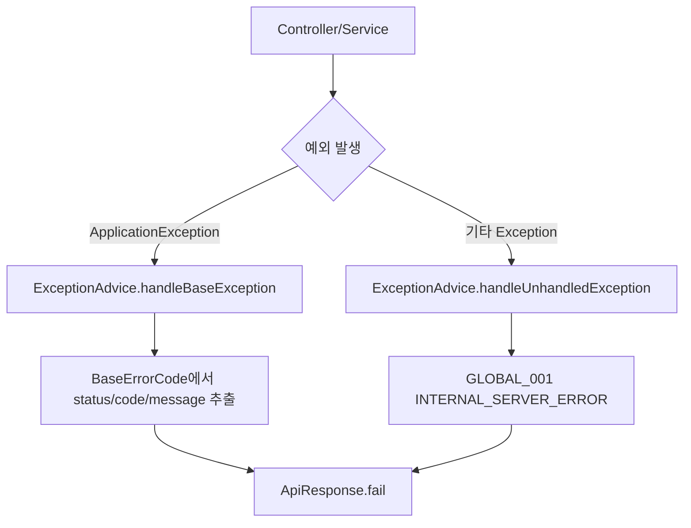

대표 에러 코드 예시:

| 도메인 | 코드 | HTTP Status | 의미 |
| --- | --- | --- | --- |
| Global | `GLOBAL_001` | 500 | 처리되지 않은 서버 오류 |
| Global | `GLOBAL_002` | 400 | 잘못된 입력값 |
| Global | `GLOBAL_003` | 401 | 유효하지 않은 토큰 |
| Mission | `MISSION_006` | 409 | 중복 미션 요청 |
| Mission | `MISSION_010` | 400 | 잘못된 커서 |
| Mission | `MISSION_012` | 400 | 보상 거절 사유 누락 |
| Appeal | `APPEAL_003` | 403 | 이의제기 접근 권한 없음 |
| Appeal | `APPEAL_011` | 409 | 중복 PENDING 이의제기 |
| Upload | `UPLOAD_002` | 400 | 허용되지 않은 MIME 타입 |
| Upload | `UPLOAD_004` | 500 | 업로드 실패 |

## ERD 요약 🧱

상세 ERD 문서는 `src/main/resources/db/migration/docs/ERD.md`에 있고, README에는 도메인 관점에서 핵심 관계만 요약합니다.

### 핵심 엔티티 묶음 📚

- 사용자/가족: `customer`, `admin`, `family`, `family_member`
- 정책/쿼터: `policy`, `policy_assignment`, `customer_quota`, `family_quota`
- 미션/보상: `mission_item`, `mission_request`, `mission_log`, `reward`, `reward_template`, `reward_grant`
- 이의제기: `policy_appeal`, `policy_appeal_comment`
- 집계/리캡: `usage_record`, `family_recap_monthly`, `family_recap_weekly`
- 이벤트: `event_outbox` 성격의 `usage_event_outbox`와 애플리케이션의 notification outbox 테이블

### 관계 요약 🔗

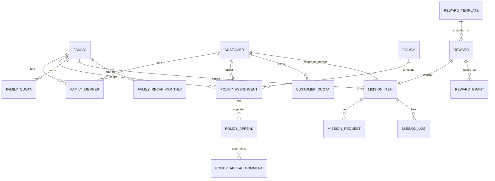

### 도메인별 저장 포인트 🗃️

| 도메인 | 주요 테이블 | 설명 |
| --- | --- | --- |
| 인증/사용자 | `customer`, `admin`, `family_member` | 로그인 주체와 가족 내 역할 관리 |
| 정책 | `policy`, `policy_assignment`, `customer_quota` | 템플릿과 실제 적용 상태를 분리 |
| 미션 | `mission_item`, `mission_request`, `mission_log` | 할당, 요청, 감사 로그를 분리 |
| 보상 | `reward_template`, `reward`, `reward_grant` | 템플릿과 발급 보상 스냅샷 분리 |
| 이의제기 | `policy_appeal`, `policy_appeal_comment` | 본문과 댓글을 분리 |
| 리캡 | `family_recap_monthly` | 월간 스냅샷을 JSON 포함 형태로 저장 |

## 설정 포인트 ⚡

`src/main/resources/application.yml` 기준 주요 환경 변수입니다.

- `DATABASE_URL`, `DATABASE_USER`, `DATABASE_PASSWORD`
- `JWT_SECRET_KEY`, `JWT_ACCESS_TOKEN_EXPIRES_IN`, `JWT_REFRESH_TOKEN_EXPIRES_IN`
- `REDIS_HOST`, `REDIS_PORT`, `REDIS_PASSWORD`
- `KAFKA_BOOTSTRAP_SERVERS`
- `R2_ENDPOINT`, `R2_ACCESS_KEY`, `R2_SECRET_KEY`, `R2_BUCKET`, `R2_CDN_BASE_URL`
- `FRONTEND_URL`
- `OTEL_EXPORTER_OTLP_ENDPOINT`

## 로컬 실행 ▶️

```bash
./gradlew bootRun
```

Windows:

```powershell
.\gradlew.bat bootRun
```

테스트:

```bash
./gradlew test
```

Swagger UI:

- `http://localhost:8080/swagger-ui.html`

OpenAPI:

- `http://localhost:8080/v3/api-docs`

## 데이터베이스와 마이그레이션 🛠️

- Flyway를 사용해 스키마를 관리합니다.
- 마이그레이션 파일은 `src/main/resources/db/migration`에 있습니다.
- ERD 문서는 `src/main/resources/db/migration/docs/ERD.md`에 있습니다.

## 테스트 현황 🧪

- 서비스 단위 테스트와 일부 통합 테스트가 `src/test/java`에 구성되어 있습니다.
- 대표적으로 `mission`, `reward`, `appeal`, `family`, `policy`, `recap`, `upload` 관련 테스트가 존재합니다.
